

<picture>
  <source media="(prefers-color-scheme: dark)" srcset="assets/header-dark.svg">
  
</picture>

I design and build complete systems, from the database schema to the production UI, for businesses that run on WhatsApp, spreadsheets and manual work. I usually work as the only engineer, directly with the owner, and answer for the result end to end. AI is a component I engineer carefully: the model reads, talks and judges, while prices, state and money go through code that can be tested.

## Featured work

<table>
  <tr>
    <td width="50%">
      <a href="#lexinton-crm"><picture><source media="(prefers-color-scheme: dark)" srcset="assets/card-crm-dark.svg">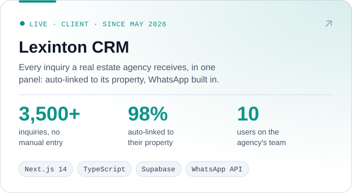</picture></a>
    </td>
    <td width="50%">
      <a href="#zizu"><picture><source media="(prefers-color-scheme: dark)" srcset="assets/card-zizu-dark.svg">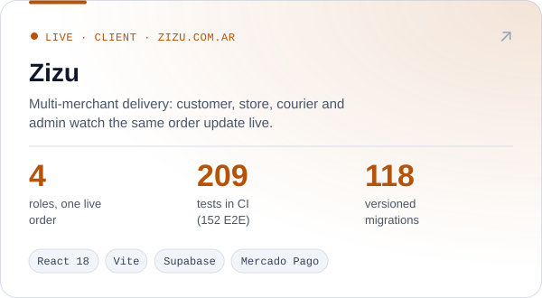</picture></a>
    </td>
  </tr>
  <tr>
    <td width="50%">
      <a href="#tomanota"><picture><source media="(prefers-color-scheme: dark)" srcset="assets/card-tomanota-dark.svg">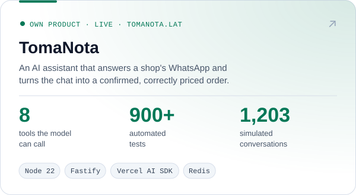</picture></a>
    </td>
    <td width="50%">
      <a href="#tasador-rag"><picture><source media="(prefers-color-scheme: dark)" srcset="assets/card-tasador-dark.svg">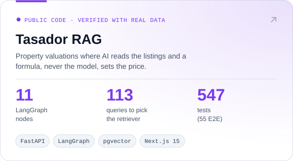</picture></a>
    </td>
  </tr>
</table>

---

## Lexinton CRM · every inquiry in one panel

**Real estate agency in Buenos Aires · Live since May 2026 · 10 users** · [panel.lexinton.com.ar](https://panel.lexinton.com.ar)

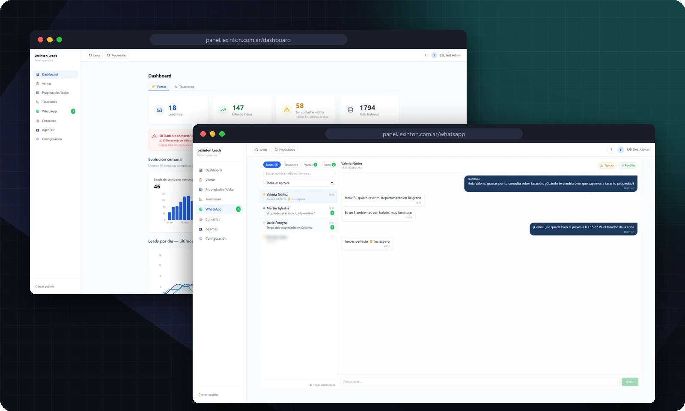

Buyer and tenant inquiries arrived every day through listing portals, Facebook ads and the website, and ended up in a shared inbox. Each one depended on someone copying it into a spreadsheet by hand. Now every inquiry lands in a single panel with no manual entry: already linked to the property it asks about, assigned to the right agent, and followed up from there, including on the agency's WhatsApp.

- **6 intake channels, zero manual entry.** The inbox is read every 15 minutes. Each inquiry is matched to its portal, repeat contacts are detected (also when the same lead arrives from the portal and again through Tokko), and the lead is linked to its property by listing code or, failing that, by address.
- **Tokko Broker integration.** Read-only mirror of the agency's listings, prices, developments and agents. The same inventory feeds the agency's website, which I also built: [lexinton.com.ar](https://lexinton.com.ar), with 177 pre-generated pages and a 100/100 SEO score.
- **WhatsApp on Meta's official Cloud API.** Every conversation sticks to the client's record. Signed webhooks, sends queued in PostgreSQL, 24-hour window handled with 9 approved templates.
- **Automations that know when to stop.** 7 follow-up flows, configurable from the panel, that cancel themselves the moment the client replies.
- **Google Calendar per agent** for visits, and a dashboard where the owner sees the business in numbers for the first time.

> **3,500+ inquiries · 98% of last month's portal leads linked to their property automatically · 207 valuations · 186 visits · 6,805 audited status changes · 100 unit + 33 E2E tests**

`Next.js 14` `TypeScript` `Supabase (PostgreSQL · RLS · Realtime · Edge Functions)` `Tokko Broker API` `WhatsApp Cloud API` `Gmail API` `Google Calendar API` `Vitest` `Playwright` `Vercel`

Screenshots use demo data.

---

## Zizu · multi-merchant delivery with online payments

**Client in Argentina · Live in production** · [zizu.com.ar](https://zizu.com.ar)

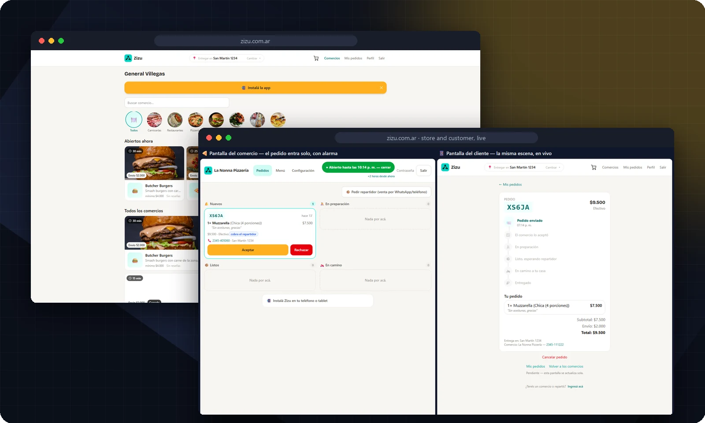

In small cities, shops take orders by phone and WhatsApp, with no platform to coordinate customer, shop and courier. Zizu is that platform: the customer orders, the shop prepares, the courier delivers and the admin oversees, each on their own screen, all watching the same order update live. I built it solo, from scratch, in 4 milestones that were delivered, audited and billed.

- **Money that can't be corrupted.** Mercado Pago end to end: checkout, chargebacks, refunds and commissions, plus cash. Every payment is confirmed server to server through a signed, idempotent webhook. The payment ledger is append-only, protected by triggers, and can't be edited even with direct database access.
- **Rules live in the database, not the UI.** Row Level Security on all 30 tables and order state transitions enforced server-side, so each role can only make its own moves.
- **Atomic order assignment.** If two couriers tap "Take" at the same time, exactly one wins. This is verified by a real concurrency test.
- **Real time and installable.** Supabase Realtime across the four areas, an installable PWA, and code-splitting by role.

> **152 E2E + 57 unit tests on every change, against a production-identical environment · 118 versioned migrations · 4 milestones delivered and billed**

`React 18` `Vite` `TypeScript` `Supabase (PostgreSQL · RLS · Realtime · Edge Functions · pg_cron)` `Mercado Pago` `TanStack Query` `Zustand` `Playwright` `GitHub Actions` `Vercel`

---

## TomaNota · an AI assistant that takes orders on WhatsApp

**Own product · Live** · [tomanota.lat](https://tomanota.lat) · [Try the demo, no sign-up](https://app.tomanota.lat/probar)

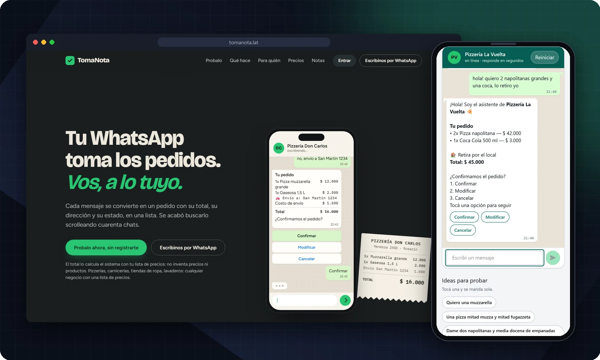

The neighborhood pizzeria takes orders on WhatsApp while the owner works the counter. At peak hours messages go unanswered and orders get jotted on paper, with mistakes. TomaNota answers that WhatsApp: it chats with the customer like a person would, builds the order with the menu's real prices, confirms it and drops it on a board for the shop to prepare. Orders from WhatsApp, the online QR menu and the counter all land on the same board.

- **The model can't get the money wrong.** It works through 8 tools with closed parameters: it emits product ids and quantities, and the server computes every price and total. No order exists until the customer taps *Confirm*. Anything that isn't on the menu doesn't get promised.
- **Deterministic guards before the model.** Messages are processed in order per chat, duplicates are discarded in Redis and in the database, the bot goes silent when the owner writes, and bot-to-bot loops are cut off. A rules engine takes over if the model fails.
- **Built for real stores.** Sizes, extras with min and max, nicknames ("muza"), half-and-half with its own price, and sale by weight. Delivery zones are inferred from the address: 17 of 17 real addresses resolved without asking.
- **Multi-tenant from the first table.** Row Level Security on 46 of 46 tables. A new store is configuration, not code.

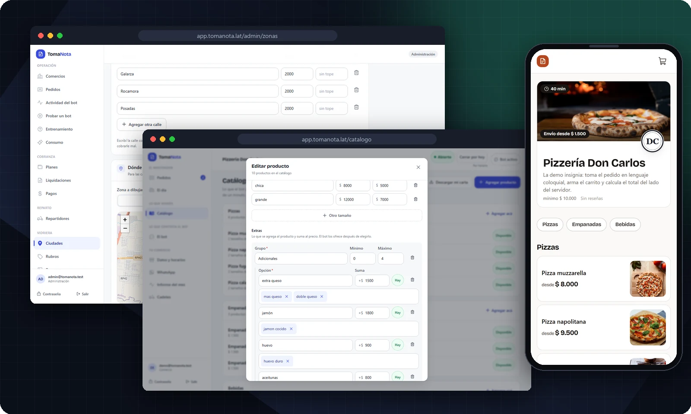

> **900+ automated tests (847 unit + 88 against real Postgres) · 13 full conversations stored as specification · test bench with 1,203 simulated conversations against the real model**

`Node.js 22` `TypeScript` `Fastify` `Vercel AI SDK · OpenAI-compatible API` `tool calling` `Supabase (PostgreSQL · RLS · Realtime)` `Redis` `WhatsApp Cloud API` `React 18` `Vite` `Docker` `Vitest`

---

## Tasador RAG · property valuations where the model never sets the price

**Real estate agency in Buenos Aires · Full application verified end to end with real market data** · [Source code](https://github.com/ricardobing/tasador-rag)

To price a listing, an agent compares it by hand against similar listings: 30 to 60 minutes per valuation, with no written reasoning. Tasador produces the report in about a minute, with the comparable listings that justify the price. AI finds and reads the listings and decides which ones are comparable. **The price comes from an explicit formula, never from the model**, and every fact the AI extracts carries a quote that is checked against the original text, without AI.

<picture>
  <source media="(prefers-color-scheme: dark)" srcset="assets/rag-eval-dark.svg">
  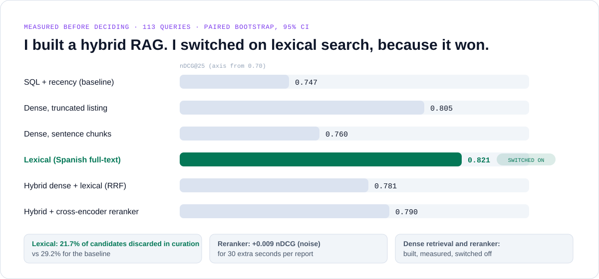
</picture>

- **A full RAG stack, measured before choosing.** Chunking, local embeddings in pgvector, Spanish full-text search, Reciprocal Rank Fusion and a cross-encoder reranker. They were compared over 113 queries with a paired bootstrap, against acceptance criteria written *before* measuring. Lexical search, the simplest option, won and is the one switched on. Dense retrieval and the reranker are built, measured and switched off.
- **An 11-node LangGraph agent** with a Postgres checkpoint: if the process dies at step 6, it resumes at step 6.
- **A two-phase critic.** A deterministic pass traces every number in the generated text back to the data, and one untraceable number rejects the draft. An adversarial model pass follows. Audited with injected fake prices: 50.5% got through at first, and 4.3% after three measured fixes.
- **It knows when to say "I don't know".** With fewer than 5 valid comparables, it returns `INSUFFICIENT_DATA`. A second RAG ("Ask the report") answers with verified citations, or refuses in milliseconds when there's no evidence.

<picture>
  <source media="(prefers-color-scheme: dark)" srcset="assets/tasador-architecture-dark.png">
  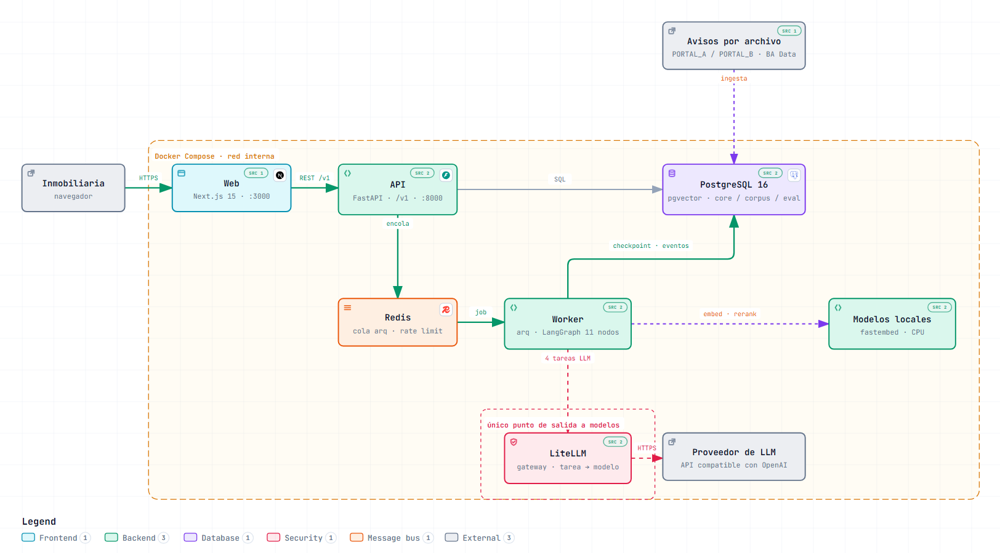
</picture>

> **492 backend tests + 55 Playwright E2E tests against the real stack, in CI · 9-service Docker Compose · 2 to 5 US cents per report, cost traced per node**

`Python 3.12` `FastAPI` `LangGraph` `PostgreSQL 16 + pgvector` `Redis` `fastembed` `LiteLLM` `Next.js 15 (React 19, TypeScript)` `Docker Compose` `GitHub Actions` `pytest` `Playwright`

---

## More public work

| Project | What it shows |
| --- | --- |
| [**CORIS · Claude tool use agent**](https://github.com/ricardobing/CORIS-claude-tool-use) | Agent built on Anthropic's tool use: agent loop, schemas, parallel tools, prompt-injection defenses, retries with feedback, deterministic fallback, and cost, token and latency metrics |
| [**Doctor de Planillas**](https://github.com/ricardobing/excel-doctor) | Diagnoses and cleans messy Excel files: ~20 detectors, a 0-100 health score, and every fix logged |

## Stack

  
   
  

**AI:** LangGraph · Vercel AI SDK · Anthropic Claude · OpenAI-compatible APIs · tool calling · RAG (pgvector, full-text, RRF, reranking) · retrieval evaluation (nDCG, MRR, bpref) · eval benches against the real model

**Integrations:** WhatsApp Cloud API · Mercado Pago · Tokko Broker · Gmail API · Google Calendar API · signed, idempotent webhooks · Make

**Quality:** Playwright E2E · Vitest · pytest · CI on every push · RLS and concurrency tests · environments identical to production

## How I work

- **I own the problem, not a ticket.** I take it from the first conversation with the owner to the schema, the API, the UI, the deploy and the support after launch.
- **I build with AI agents, and I test like it.** I design the architecture and direct AI coding agents (Claude Code) to build it. Quality comes from automated tests and CI on every push, not from ceremony.
- **The model never touches the money.** LLMs handle language and judgment. Prices, totals, state transitions and confirmations go through deterministic code that tests can pin down.
- **I measure before I decide.** Retrievers, prompts and critics get compared with a metric written down beforehand, and I switch on what wins, even when it's the least impressive option.

**Systems Engineering, Universidad Tecnológica Nacional (UTN)** · English: professional written communication (docs, email, Slack, PRs)

[LinkedIn](https://linkedin.com/in/ricardo-brossard) · [ricardobingeniero@gmail.com](mailto:ricardobingeniero@gmail.com)

