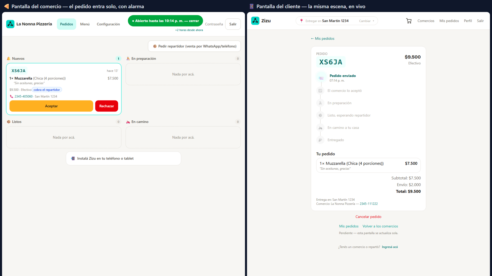
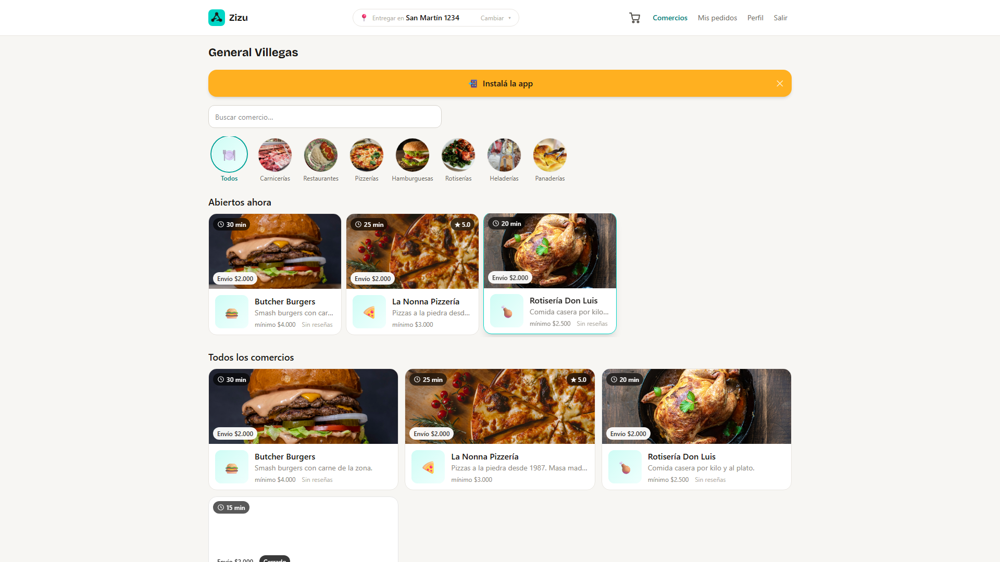
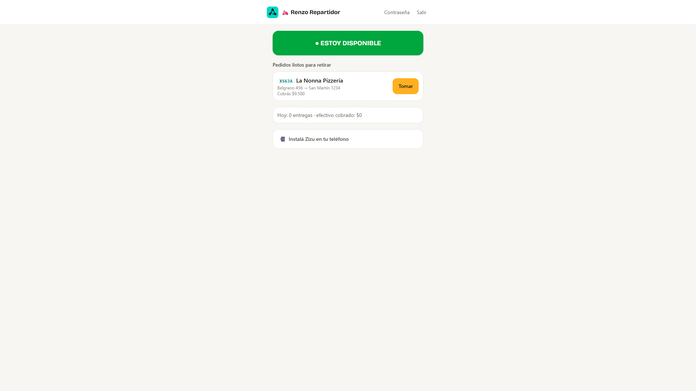
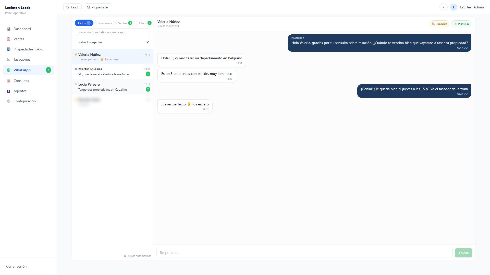
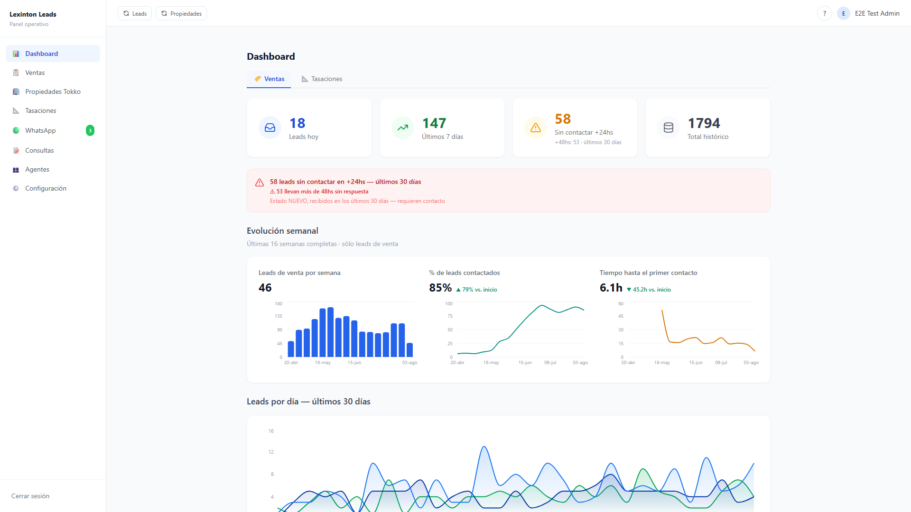
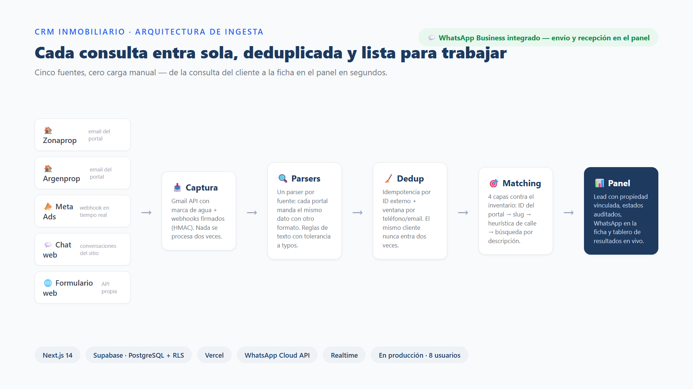

# Ricardo Brossard

### AI Engineer · Full Stack Developer

**Python · FastAPI · LLMs · OpenAI | React · Next.js · TypeScript · Node.js · PostgreSQL**

*I build full-stack systems with AI and automation that ship to production*
*and get used every day — real clients, real problems, measurable outcomes.*

[-000000?style=flat-square&logo=vercel&logoColor=white)](https://delivery-ten-mu.vercel.app)
[-FF4B4B?style=flat-square&logo=streamlit&logoColor=white)](https://excel-to-kpi-dashboard.streamlit.app/)

📍 Argentina · UTC-3 · Available for remote roles worldwide

---

## What I bring to a team

I design and ship **end-to-end systems** — from database schema to API to production UI, across **TypeScript and Python backends** — with a strong emphasis on AI integration and workflow automation. My background is in Systems Engineering, and every project I've delivered has had a real client, a real problem, and a real outcome attached to it.

I work well in environments that value **autonomy, technical depth, and delivery over process.** I don't need daily standups to stay aligned, and I don't ship code without tests.

---

## Featured Projects

---

### 🛵 Zizu — Multi-Store Delivery Platform · React · TypeScript · Supabase · Mercado Pago

**Real client, billed by milestones · Live on Vercel**
🔗 [delivery-ten-mu.vercel.app](https://delivery-ten-mu.vercel.app)

A delivery platform for small cities, built solo from zero to production. One SPA, four role areas — customer, store, courier, admin — coordinated in real time over a single Postgres database. The hard part was never the UI: it was making payments, accounting and courier assignment impossible to corrupt.

**What I built:**

- **Multi-tenant isolation via Row Level Security** on every table — each store and courier sees exactly their own data; the same pattern as a multi-tenant SaaS.
- **Order state machine enforced in the database** (`security definer` functions): each role can only execute its own transitions. The UI disables buttons, but the rule holds even against direct API calls.
- **Real-time everything** (Supabase Realtime): new orders ring on the store's screen, the customer's timeline updates live, out-of-stock items vanish from open menus.
- **Atomic courier assignment** — two couriers tapping "Take" simultaneously get exactly one winner, verified with a real concurrency test (two competing sessions).
- **Mercado Pago end-to-end**: server-to-server payment confirmation, signed (HMAC) idempotent webhook, chargebacks and refunds covered by tests, and an **append-only accounting ledger** protected by triggers — changing today's commission can never rewrite yesterday's books.
- **Installable PWA** with custom install UX for Android and iOS.

<table>
  <tr>
    <td width="50%"></td>
    <td width="50%"></td>
  </tr>
</table>

> **138 E2E tests (Playwright, real browsers) on every push in GitHub Actions · 101 versioned SQL migrations — the whole system reproduces from the repo · 4 milestones delivered and billed · test environment identical to production, self-restoring after every CI run**

---

### 🏠 Real Estate CRM with WhatsApp built in — Next.js 14 · Supabase · WhatsApp Cloud API

**Lexinton Propiedades, Buenos Aires · In production since April 2026 · 8 daily active users**
🔗 [panel.lexinton.com.ar](https://panel.lexinton.com.ar)

The agency ran on spreadsheets — one per property. Leads were logged by hand (or not at all), follow-up depended on each agent's memory, and the owner had zero visibility. Today the entire agency operates on one system, and the business's WhatsApp lives inside it.

**What I built:**

- **Automatic lead ingestion from 5 sources** (ZonaProp, Argenprop, Tokko, Meta Ads, web chat) via Gmail API: one parser per portal, deduplication in a 30-minute window, and **4-layer fuzzy matching** against the property inventory — leads land in the panel with the right property already linked.
- **Sales and appraisal pipelines as state machines** with a full audit trail: who changed what, and when — always.
- **WhatsApp Cloud API integrated directly — no BSP, no monthly license**: a multi-agent inbox inside the panel (per-context tabs, live unread counters, role-based permissions), HMAC-SHA256 signed webhook, and 24-hour-window handling with Meta-approved templates read live from the API.
- **An automation engine backed by a Postgres queue**: messages scheduled by business events (new appraisal, status change, upcoming visit), with configurable offsets, business-hours windows — and **automatic cancellation of the whole chain the moment the client replies**. 7 flows, all configurable from the panel without touching code.
- Google Calendar integration (per-user OAuth) and a results dashboard the owner opens every morning.

It replaced a stack of Google Sheets + Apps Script + Make + OpenAI (with monthly costs) with a one-time-payment system.

<table>
  <tr>
    <td width="50%"></td>
    <td width="50%"></td>
  </tr>
</table>

*Screenshots use synthetic/demo data — no real client information.*

> **2,631 leads · 383 appraisals · 3,695 audited status changes · 8 daily users · 9 Meta-approved WhatsApp templates · 7 automation flows · response time cut from 54h to under 24h**

---

### 🌐 Real Estate Website — Next.js 14 · Tokko Broker API · ISR · Supabase

**Lexinton Propiedades, Buenos Aires · Live in production**
🔗 [lexinton.com.ar](https://lexinton.com.ar)

Full website from scratch, replacing an outdated WordPress with no CRM integration. Next.js Route Handlers act as a secure proxy to Tokko Broker — the API key never reaches the client. ISR with staggered revalidation keeps 175+ listings fresh without hammering the API. Dual lead system: every form submission goes simultaneously to Tokko and to the CRM above. Tokko has no public documentation — I mapped the real endpoint structure through Python debugging scripts.

> **175+ properties in real time · SEO 100/100 · CLS 0 · 177 ISR pre-generated routes · direct lead channel independent of third-party portals**

---

### 📊 KPI Commercial Dashboard — Open Source · Python · Streamlit

**Public portfolio project**
🔗 [Live demo](https://excel-to-kpi-dashboard.streamlit.app/) · [Source code](https://github.com/ricardobing/excel-to-kpi-dashboard)

A data pipeline with strict layer separation (ETL / KPI engine / Pareto A-B-C segmentation / automated alert engine). 51 pytest tests validate the complete business logic independently from the UI. 30,000+ records processed in under 3 seconds. Full source code visible on GitHub — this one you can actually read.

---

## Tech Stack

**AI / LLMs**

-D97757?style=flat-square&logoColor=white)

Context engineering · Prompt engineering · Structured output / function calling · Deterministic fallback + human escalation · Agentic workflows · AI observability

**Backend**

-3FCF8E?style=flat-square&logo=deno&logoColor=white)

**Frontend**

**Databases**

-4169E1?style=flat-square&logo=postgresql&logoColor=white)

Row Level Security · Triggers · Append-only ledgers · Window functions · CTEs · Materialized views · State machines in the database · Realtime

**Integrations & Automation**

-6D00CC?style=flat-square&logo=make&logoColor=white)

Signed webhooks (HMAC) · Idempotent payment processing · Gmail API · Google Calendar API · Google Maps API · Cron jobs · DB triggers

**Testing & Infrastructure**

E2E tests in real browsers · Concurrency tests · RLS security tests · Test environments identical to production · Feature flags

---

## How I work

**I think in systems, not features.**
Before writing a single line I model the data, define the contracts between layers, and map the failure modes. The architecture exists before the first commit.

**I measure what I ship.**
Every project I've delivered has metrics: leads captured, hours saved, time reduced. I don't consider something done until I can tell the client whether it's working.

**I own the full stack.**
I take a problem from database schema to API to production UI. No handoffs between layers — one person who understands the whole system.

**I integrate AI where it solves a real problem.**
Not as a feature, but as a component — with context engineering, structured output validation, fallback logic, and observability. If the LLM fails, the system degrades gracefully instead of silently hallucinating. And I know when *not* to use it: I once replaced a monthly OpenAI classification bill with deterministic rules that did the same job for free.

**I work async, document as I go, and don't need supervision to stay on track.**
I've shipped production systems as a solo contributor. English: professional written communication — docs, email, Slack, PRs.

---

## Education

**B.Eng. in Information Systems Engineering**
Universidad Tecnológica Nacional (UTN) — Facultad Regional Concepción del Uruguay, Argentina

---

📍 Argentina · UTC-3 · Open to remote roles worldwide

✉️ [ricardobingeniero@gmail.com](mailto:ricardobingeniero@gmail.com) · [LinkedIn](https://linkedin.com/in/ricardo-brossard)

*If you're building something serious and need someone who ships — let's talk.*

